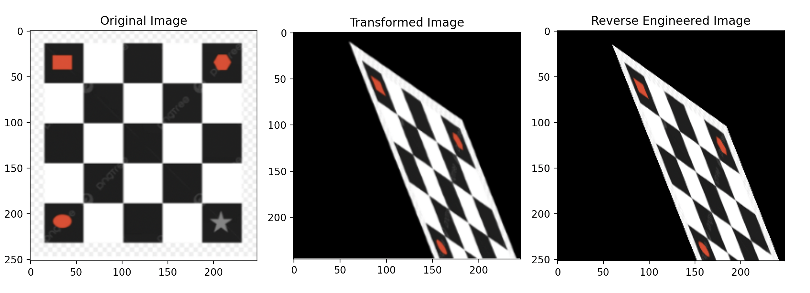
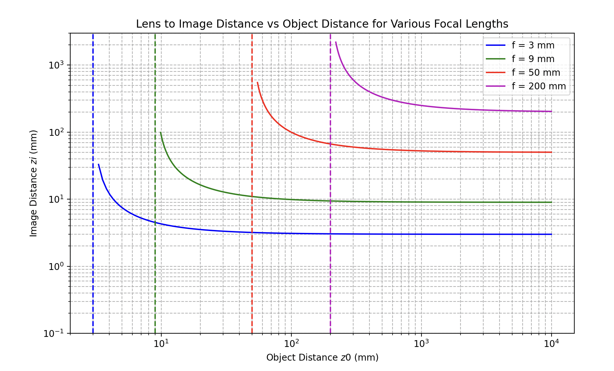
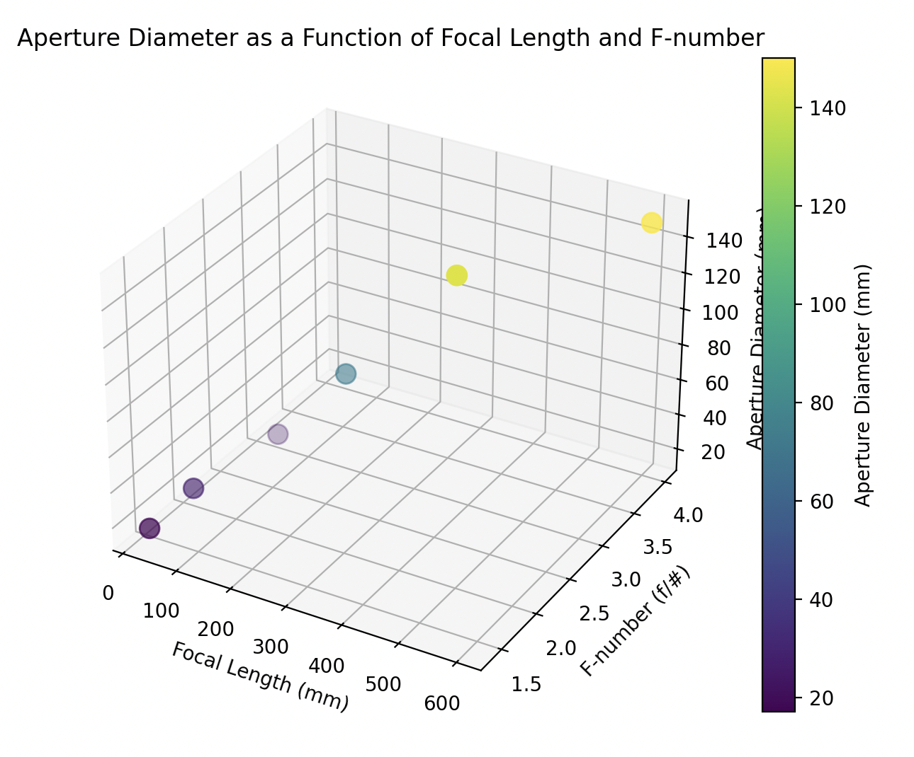
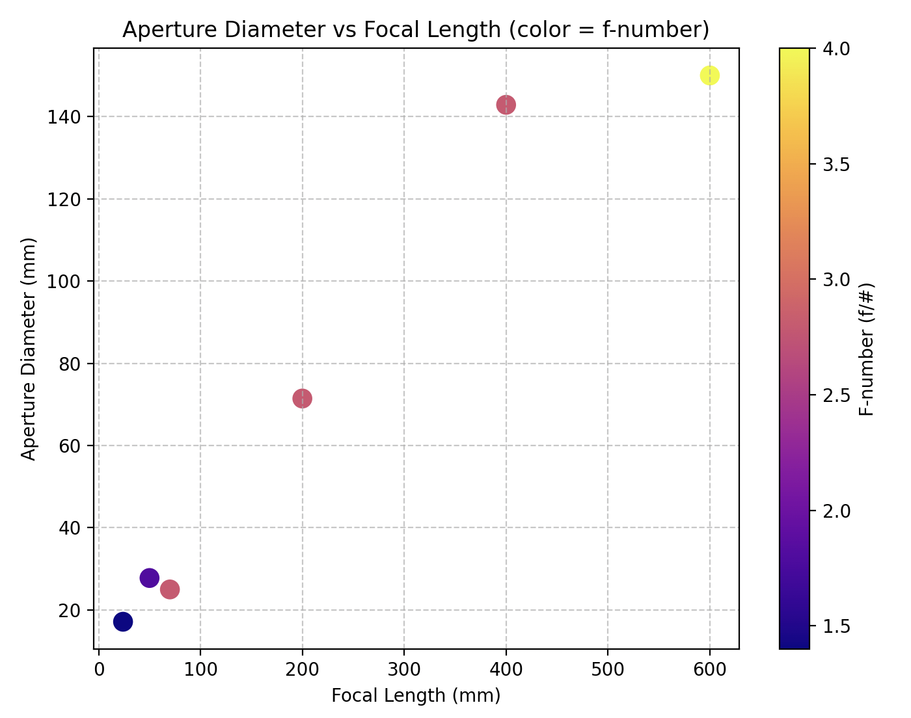
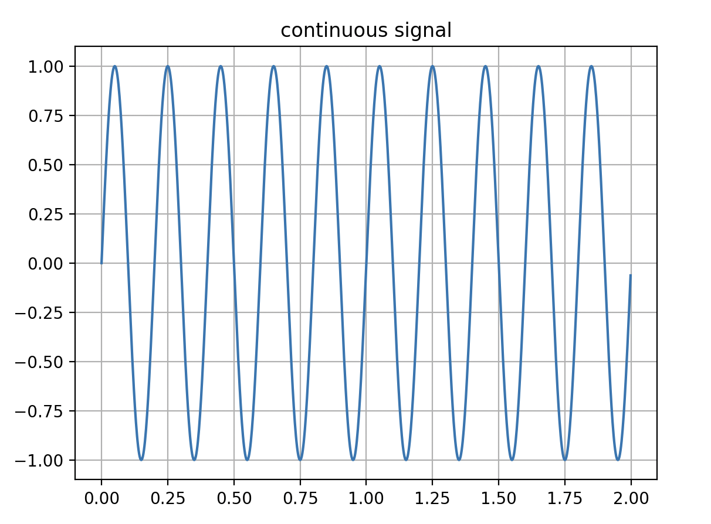
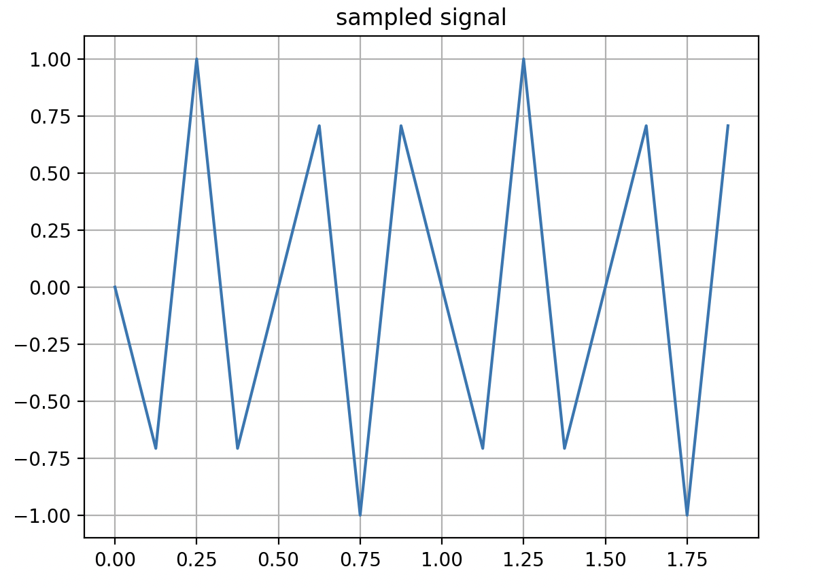
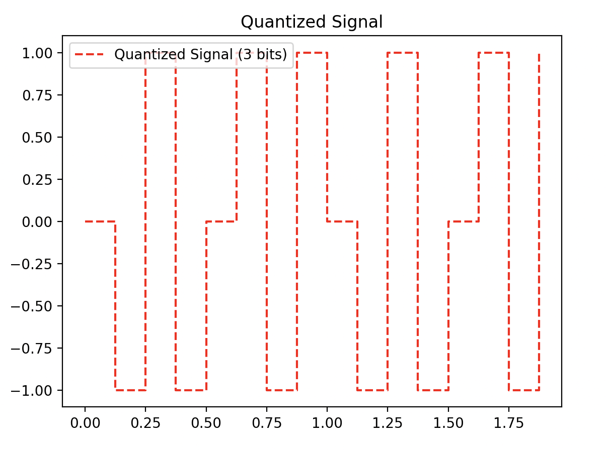
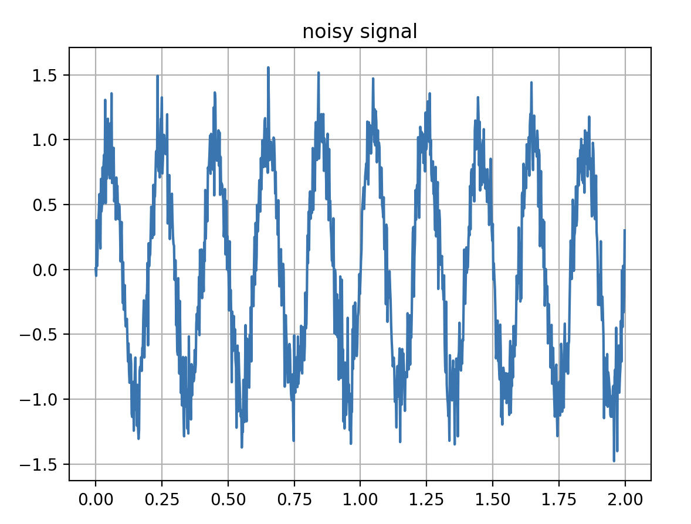
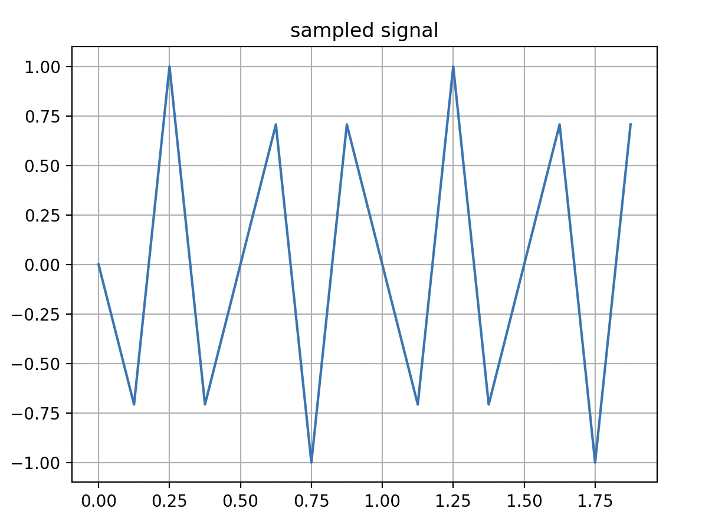

QUESTION: DO I NEED TO ADD PLOTS IN HERE

Exercise 1: Reverese Engineering 2D Transformations

To run geometric_transforms.py: 
1) Install numpy, matplotlib, and openCV
2) In terminal run: python3 geometric_transforms.py 

I first performed an affine transformation by defining 3 original points (x,y) and then providing the desination of those points in the transformed image. The getAffineTransform function created the affine matrix for me. The warpAffine function was used to apply the transformation. Affine is a combination of rotation, translation, and sheer. 

The result form the affine transformation was extremely close to the transformed image, but was a little too high. So, I applied a slight vertical translation to move the image down 7 pixels. 

Exercise 2: Thin Lens Law and F-Number Plots 

To run lens_aperature_params.py: 
1) Install numpy and matplotlib
2) In terminal run: python3 lens_aperature_params.py

The original thin lens law was given in class as 1/f = (1/z0) + (1/zi). Therefore, the equation to plot the lens to image distance (zi) as a function of the object distance (z0) would be zi = 1 / ((1/f) - (1/z0)).

The f number is calculated by f/D where f is the focal lenght and D is the aperature diameter. Therefore, to calculate the aperature diameter based on given focal lenghts and f#s would be D = f / f number. 

Aperature diameter needed for each lens to acheive their stated max f number: 
1) 24mm, f/# = 1.4 the diameter = 17.14mm
2)  50mm, f/1.8 the diameter = 27.78mm
3)  70mm, f/2,8 the diameter = 25.00mm
4) 200mm, f/2,8 the diameter = 71.43mm
5)  400mm, f/2,8 the diameter = 142.86mm
6)  600mm, f/4.0 the diameter = 150.00mm

Exercise 3: Sampling and Quantization 

To run sampling_quantization.py
1) Install numpy and matplotlib 
2) In terminal run: python3 sampling_quantization.py

What should the reasonable sampling frequency be to capture the true shape of the signal?

According to the Nyquist-Shannon Theorem, the sampling frequency must be at least twice the highest spatial frequency of the detail in the image. 

In our global variables, we have signal_freq = 5. Therefore, the sampling_freq should be at least 2(5) = 10 according to the Nyquist theorem. Setting sampling_freq to 8 will cause aliasing. A value of 10 Hz is the theoretical minimum to avoid aliasing. However, when sampling_freq is set to exactly 10 Hz, the quantized levels in the staircase plot appear as a straight line. This is because we are sampling exactly two points per cycle of the sine wave, producing a very limted set of quantized values. Mathematically, aliasing is avoided, but the samples do not capture the true shape of the waveform. Therefore, a sampling frequency higher than 10 Hz, such as 15 Hz, is more reasonable to accurately represent the signal. 

What should should be done to minimize error?

There are two places for error, the first one is during sampling, where the sampling frequency does not satisfy the Nyquist Shannon Theorem. The second error happens during digitalization, where a finite number of discrete values are assigned to the points gathered in sampling. In the code there are only 8 levels because of 3 bits. Increasing the number of amplitude levels reduces quantiztion error. For instance, 8 bits would give 256 levels. The bit number should be chosen based on SNR/precision and storage/processing tradeoffs. 

Exercise 4: Noise and error analysis 

To run error_noise_analysis.py: 
1) Install numpy and matplotlib
2) Ensure sampling_quantization.py script is in the same folder so functions can be resued 
3) In terminal run: python3 error_noise_analysis.py

Results: 
MSE: 0.042538
RMSE: 0.206247
PSNR: 13.71 dB

MSE is the average squared difference between the original and the noisy signal. The MSE is fairly samll relative to the signal range of 2, so the noise is noticeable but not overwhelming. 

RMSE confirms what was expected from the noise standard deviation (0.2), so the noise level is consistent with the variables and code design. 

PSNR measures the signal strength relative to the noise. The higher the PSNR the less noise and better signal quality there is. 13.71 is low so there will be low quality. 