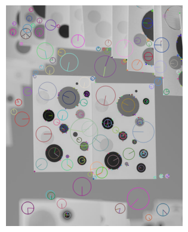
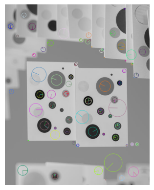
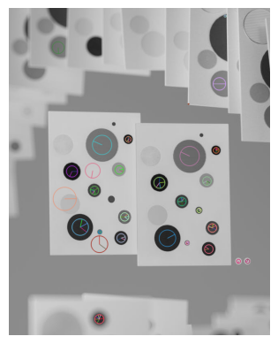
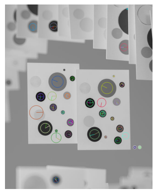

Part 1: Blob Detection

The output with default parameters produced many noisy keypoints. While most prominent blobs in the image had keypoints near their centers, there were numerous unwanted detections along the edges of the cards and throughout the gray background. Many small keypoints also appeared around the edges of the blobs, even when a keypoint alreay existed at the blob's center. 

Larger cirlces were drawn around larger blobs and smaller ones around smaller blobs, demonstrating the scale-invarient nature of SIFT. However, the larger blbos were not fully covered by keypoints, whereas the smaller blobs were. This suggests an issues with seleecting the appropriate scale for larger features. 

Part 2: Tuning Blob Detection Performance

First, to reduce the number of noisy keypoints along blob edges, I first adjusted the edgeThreshold parameter. Lowering it from the default value of 10 to 2 minimized small, redundant keypoints around the blob edges. 

Next, I noticed noisy keypoints near the corners of the cards and one large keypoint in the gray background. To address this, I increased the contrastThreshold from 0.04 to 0.09 to filter out weak features in low contrast regions. This adjustment focused detection on the central cards, preserving the main blobs while removing most background keypoint noise. 

Finally, I aimed to improve the keypoint coverage for the larger blobs. I increased the nOctiveLayers parameter from 3 to 5 to add more intermediate scales per octiave, enhacing detection for both small and large features. This adjustment successfully detected a few additional small blobs in the center and upper cards, though it also introduced two extra noisy keypoints. Since it captured three new valid blobs, I kept this change. However, it did not significantly improve coverage of the larger blobs. 

In the final output, 104 keypoints were dettected, with 26 correct blobs (counted manually). 

- Increasing the contrastThreshold decreased the total number of keypoints 
- Decreasing the edgeThreshold also reduced noisy detections 
- Increasing the nOctaveLayers slightly increased the total keypoints. 

Overall, parameter tuning helped eliminate poor condidate keypionts and acheive a cleaner detection that better emphasizes the true circular blobs in the image. 

Part 3: Descriptors 

