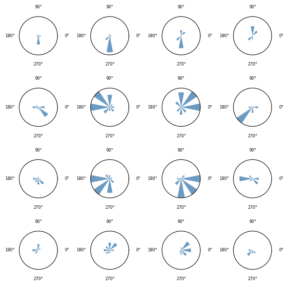
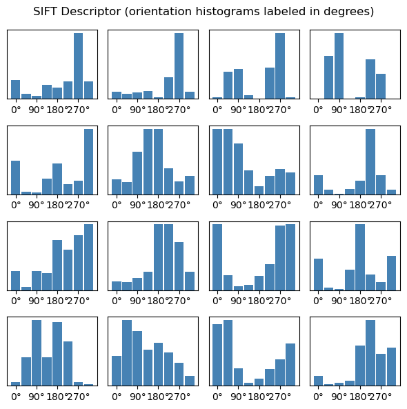
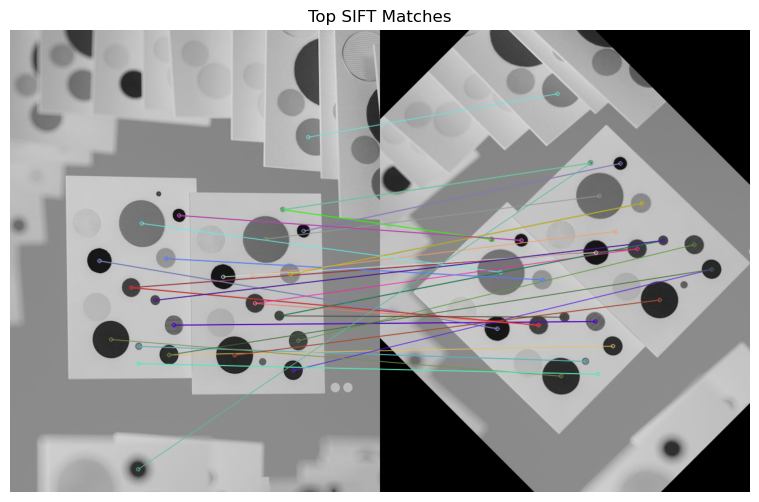
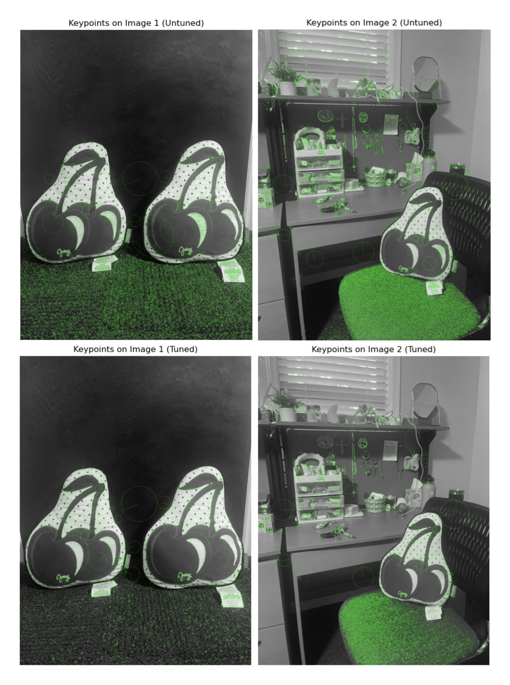
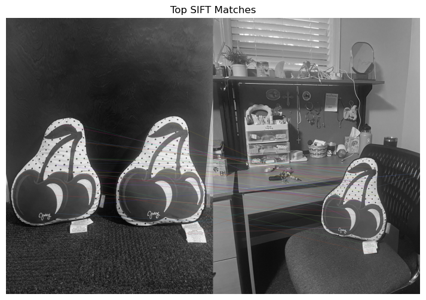

# Part 1: Blob Detection

The output with default parameters produced many noisy keypoints. While most prominent blobs in the image had keypoints near their centers, there were numerous unwanted detections along the edges of the cards and throughout the gray background. Many small keypoints also appeared around the edges of the blobs, even when a keypoint alreay existed at the blob's center. I also noticed that ligher blobs, especially on the background cards, were not picked up as blobs because the contrast was not large enough. 

Larger cirlces were drawn around larger blobs and smaller ones around smaller blobs, demonstrating the scale-invarient nature of SIFT. However, the larger blbos were not fully covered by keypoints, whereas the smaller blobs were. This suggests an issues with seleecting the appropriate scale for larger features. 

# Part 2: Tuning Blob Detection Performance

First, to reduce the number of noisy keypoints along blob edges, I first adjusted the edgeThreshold parameter. Lowering it from the default value of 10 to 2 minimized small, redundant keypoints around the blob edges. 

Next, I noticed noisy keypoints near the corners of the cards and one large keypoint in the gray background. To address this, I increased the contrastThreshold from 0.04 to 0.09 to filter out weak features in low contrast regions. This adjustment focused detection on the central cards, preserving the main blobs while removing most background keypoint noise. 

Finally, I aimed to improve the keypoint coverage for the larger blobs. I increased the nOctiveLayers parameter from 3 to 5 to add more intermediate scales per octiave, enhacing detection for both small and large features. This adjustment successfully detected a few additional small blobs in the center and upper cards, though it also introduced two extra noisy keypoints. Since it captured three new valid blobs, I kept this change. However, it did not significantly improve coverage of the larger blobs. 

In the final output, 104 keypoints were detected, with 28 correct blobs (counted manually). 

Methods used: 

- Increasing the contrastThreshold decreased the total number of keypoints. 
- Decreasing the edgeThreshold also reduced noisy detections. 
- Increasing the nOctaveLayers slightly increased the total keypoints. 

Methods not used: 

- nfeatures=0 means all keypoints that met the other parameters were kept. Identifying a number x would only keep x keypoints out of all the ones detected. 
- sigma is the initial std of the guassian kernel applied to the input image before main scale space construction begins. A larger sigma results in more blurring which preserves finer details. 

Overall, parameter tuning helped eliminate poor condidate keypionts and acheive a cleaner detection that better emphasizes the true circular blobs in the image. 

# Part 3: Descriptors 

A descriptor is a 128 dimensional vector that represents the local gradient patters around a detected keypoint. The region arouond the keypoint is divided into a grid of 4x4 cells. For each cell, the algorithm computes an orientation histogram with 8 bins, representing gradient directions (0-360 degrees). As shown in the second diagram, bin 1 is 0-44, bin 2 is 45-89, bin 3 is 90-144, bin 4 is 145-179, bin 5 is 180-224, bin 6 is 225-269, bin 7 is 270-314, and bin 8 is 315-360. 

Eeach value in the descriptor represents how strong the image gradient is in a particular direction within that cell. There are 4x4 cells each with 8 bins, giving a total of 128 values. For example, in cell[1][2], the histogram shows that the image gradient at 270 degress is very strong. The first diagram depicts the gradient directions in a circle, while the second diagram shows the numeric values of each bin; both represent the same information. 

The descriptor is rotation and scale invariant so the 4x4 grid is oriented according to the keypoint's dominate orientation, and the patch size depends on the keypoint's scale. Additionally, the descriptor is normalized to reduce the effects of illumination changes, ensuring the vector represents gradient patterns rather than absolute brightness.  

# Part 4: Feature Matching

I performed a rotation of 45 degrees. The feature matching was decently successful. Most of the important circles in the image was matched back up with each other. I did notice that the two center cards have a couple of circles that are identical, and so the feature matching would realize this and match one circle in the original image to two circles in the transformed image (because they technically have the same descriptors, but at different locations on the image). 

# Part 5: SIFT matching with your own images (Grad Only)

The goal was to be able to detect features within the cherry photo in images with a different background. 

Here are the parameter tuning decisions I made: 
- High contrast threshold to filter out keypoints found in the carpeted background of the first image. 
- Increase octave layers for better scale localization. I wanted to be able to detect the cherry features in both images where they appear as different sizes. 
- Increase sigma to smooth out noise since the images do not have high reslolution. This also places focus on larger structures. 

The detector was able to successfully match features of the cherry pillow between the two images. 