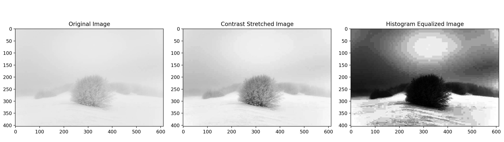
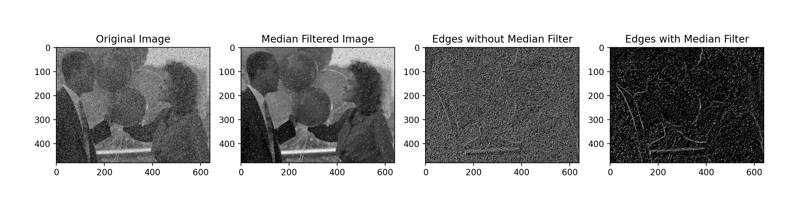
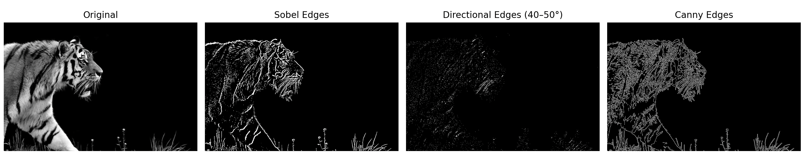

Exercise 1: Intensity Transformations and Histogram Equalization 

The low contrast image used for this exercise came from this website: https://www.istockphoto.com/photos/low-contrast

In order to display the original image, the stretched image, and the equalized histogram image, I put the main driver code for exercise 1 in equalize_histogram.py. This file calls contrast_stretch and calculate_histogram and then displays necessary results.

Therefore, for Exercise 1 run equalize_histogram.py: 
1) Install dependencies using: pip install opencv-python numpy matplotlib
2) python equalize_histogram.py

Results: 

The original image appears very washed out, with little visible contrast aside from faint details in the center branches and the bushes in the background. This is supported by the limited pixel intensity range of 129, meaning that the available 0-255 grayscale range is underutilized. 

After applying contrast stretching, the pixel values are linearly remapped so that the minimum intensity (112) maps to 0 and the maximum intensity (241) maps to 255. Intermediate pixel values are rescaled accordingly using the stretching formula. As a result, the full 0-255 range is utilized, giving the stretched image a broader dynamic range and a maximum intensity range of 255. Visually, this makes the image look more realistic and natural becauses the mapping preserves the relative relationships between pixel intensities, just stretched out. 

The histogram equalized image also shows an expanded range, but the effect is different. Histogram equalization redistributes pixel intensities so that the histogram is approximately uniform across the available bins. This enhances contrast in areas where pixel intensities were clustered, which makes faint details more visible. However, it can also produce artifacts such as a "boxy" or artificial appearance, particularly in smooth regions like the sky. This happens because histogram equalization is nonlinear, it forces intensity values into discrete jumps where the histogram was sparse, leading to abrupt intensity changes instead of smooth gradients. 

The effect of histogram eqaulization is also tied to the number of bins used. With 256 bins (the max possible for 8 bit grayscale image), each intensity level gets its own bin, which maximizes contrast enhancement but also exaggerates the boxy appearance in uniform areas.

Exercise 2: Non-Linear Filtering and Edge Detection 

The noisy image used for this exercise came from this website: 
https://people.sc.fsu.edu/~jburkardt/c_src/image_denoise/image_denoise.html

In order to display all images side by side again, the main driver code is in median_filter.py. This file calls calculate_gradient to analyze the differences between the original image, the median filtered image, the edge detected image with median filter applied, and the edge detected image without the median filter applied.

For exercise 2, run median_filter.py 
1) Install dependencies using pip install opencv-python numpy matplotlib
2) python median_filter.py

Results:

The median filter sucessfully denoises the original image because replacing each pixel's value with the median value of its neighboring pixels effectivly removes outlier pixels that often constitute "salt-and-pepper" noise. Unlike the mean, the median is robust to extreme value, making it more effective at eliminating these impulsive noise spikes without blurring edges as much. 

For edge detection, the "actual" edges in the filtered image are visually more defined than in the non-filtered image. By "actual" edges, I mean the strong changes in intensity values that I would consider an edge with my own eyes. For example, the balloon edges are much more visible in the filtered image. In the unfiltered image, salf and pepper noise introduces many false intensity changes, which the Sobel operator incorrectly amplifies as edges. 

The reason for this is because Sobel filters take the first derivative in both the horizontal (Sx) and vertical (Sy) directions. In the Sx filter, the first column is negatives and the last column is positives. That means it will emphasize changes of intensity between columns, effectively highlighting vertical edges. In the Sy filter, the top row is negatives and the last row is positives. That means it will emphasize changes of intensity between rows, effectively highlighting horizontal edges. Since salt and pepper noise is typically very dark (0 intensity) or very bright (255 intensity), it creates artificial steep changes in pixel intensity. The sobel filters will emphasize the noisy intensity changes, taking emphasis away from the actual edges in the image. The median filter supresses the noisy pixels, allowing the Sobel filters to highlight the real structured edges more clearly. My analysis is further supported with the following statistics: 

1) Without Median Filter: 
    - Mean Gradient Magnitude: 27.354169921875
    - Std Dev of Gradient Magnitude: 39.19206998199675
    - Number of Strong Gradients (>100): 114901
2) With Median Filter: 
    - Mean Gradient Magnitude: 78.47043619791667
    - Std Dev of Gradient Magnitude: 72.46628637606494
    - Number of Strong Gradients (>100): 19870

These results show that without filtering, the images contains many weak but noisy gradients (high false postives). With filtering, the average gradient magnitude increases while the number of strong gradients decreases dramatically. This indicates that noise-induced edges were removed and mostly meaningful edges remain, making the filtered edge map both cleaner and more accurate. 

Exercise 3: Simple Sobel-based edge detector 

The image used for this exercise came from: https://learnopencv.com/edge-detection-using-opencv/

The driver code to run all necessary steps and display images side by side is in sobel_edge_detector.py. 

For exercise 3, run sobel_edge_detector.py
1) Install dependencies using pip install numpy opencv-python matplotlib
2) python sobel_edge_detector.py

The Sobel edge map highlights regions of strong intensity change by computing the gradient magnitute from the x and y Sobel filters. After applying a binary threshold, the resulting edge map successfully captures prominent edges in the image. This method is somewhat senstive to noise, however, the image I chose does not have much noise. Additionally, the threshold value strongly influences the clarity of the edges. Too low of a threshold means too many weak edges and noise included. Too high of a threshold means only the strongest edges remain, possibly losing detail. The Sobel edge map visually increased the width of edges with higher magnitudes. The Canny detector does not do this, instead all edges seem to appear with the same width. 

The directional edge detector uses both the gradient magnitude and gradient direction. By thresholding only the gradient angles around 45 degrees, diagonal edges were isolated. This produces a sparse edge map where only edges within the specified direction range are visible. 
 
One important consideration is that edge oritentation is ambiguous by 180 degrees. For example, a 45 degree edge and a 225 degree edge are equivalent orientations, so both must be considered if we want complete directional edge detection. Despite this, the method is very useful to analyze edges in a specific orientation. 

The Canny detector provides a much cleaner edge map compared to Sobel. It uses Gaussian smoothing to reduce noise, computes gradients, applies non maximum suppression to thin edges, and finally performs hysteresis thresholding to connect edges. Noise is significantly reduced compared to Sobel, edges appear sharper and more continuous, both weak and strong edges are preserved when they are a part of significant structures. Canny is more robust and widely used in practice compared to raw Sobel filtering. The image is visually more detailed than either of the Sobel and direction edge methods. 
